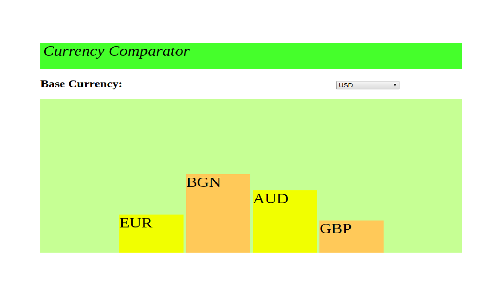

__Currency Comparator__
===================

The Currency Exchange Rate Bar Chart compares exchange rates of varying countries.

# API
The exchange rates are collected from [Exchange API](https://exchangeratesapi.io/)

A bar graph depicts the forgeign exchange rates with currency conversion.

The rates are quoted against the default base currency, USD (US dollar), by setting the parameter:base=USD. 

The base currency can be changed using the 'select' box in the application.

The followoing countries are compared by setting the symbols parameter: symbols=USD,EUR,AUD,GBP,BRL

If the user clicks on a bar in the graph, an alert box displays instructions to change the base currency.

# Built with

      HTML

      CSS

      React

      JavaScript

      Heroku Deployment
   

# To Run (Heroku):
   [Responsive Bar Graph](https://responsivebargraph.herokuapp.com/)
      
      
To Administer:

      https://git.heroku.com/responsivebargraph.git

